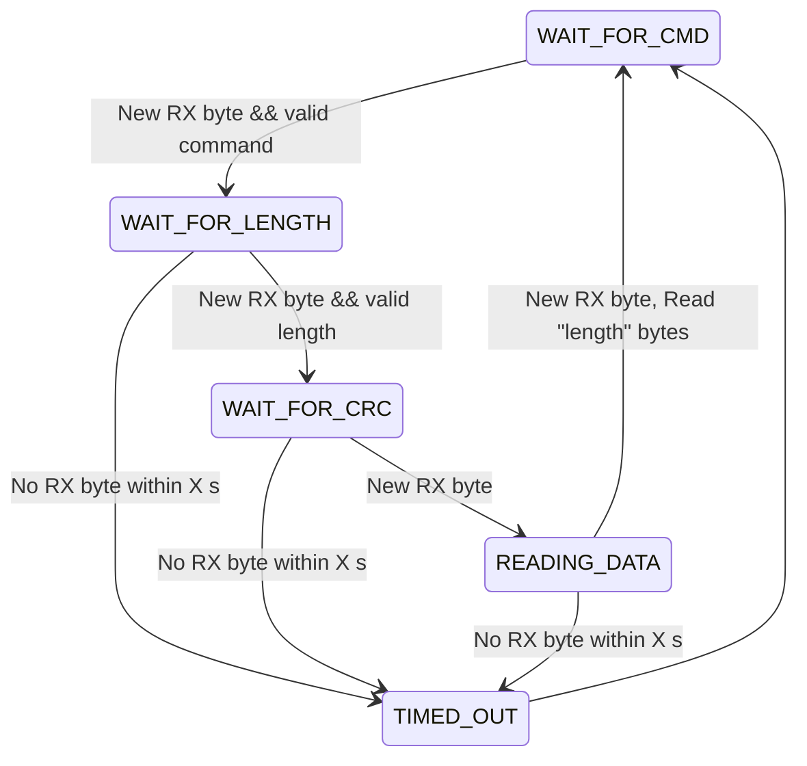

# Telemtry Node

## VSTP - Very Simple Telemetry Protocol

| Byte | Field | Description |
| --- | --- | --- |
| 0              | Command | Protocol command |
| 1              | Length  | Length of data |
| 2              | CRC     | CRC |
| 3...MAX_LENGTH | Data    | Payload data |




## TX Buffers

The telemetry node contains an internal buffer for the log data where the data is stored before it's sent upstream. This buffer is in turn divided into smaller PDU buffers, where each of the PDU buffers can contain data of size `VSTP_TX_MAX_PDU_SIZE`. This is by default set to 1024 for TCP.

The number of PDU buffers is determined by `VSTP_TX_BUF_MAX_PDUS` and defaults to 10. This means that by default, the telemtry tx buffer looks like:


| Buffer number | Size (bytes) |
| --- | --- |
| 0 | 1024 |
| 1 | 1024 |
| 2 | 1024 |
| 3 | 1024 |
| 4 | 1024 |
| 5 | 1024 |
| 6 | 1024 |
| 7 | 1024 |
| 8 | 1024 |
| 9 | 1024 |

This requires 10240 kB of RAM that will be statically allocated for the buffer (unless changed).

## RX Data reception

When telemetry node is receiving log data, it puts it into the next available tx buffer. If no buffer is available (we haven't been able to send it upstream fast enough), the new data is discarded.


When TX is transmitting, it looks at the tx buffers, and chooses the correct
buffer, with the `buffer_number`.

```
buffers[10];

tx_buf_t* buf = buffers[buffer_number];
int buf_size = buf->buf_size;

// Construct tx packet
tx_tcp_buf[PDU_SIZE];

// Copy data to TCP TX buffer
memcpy(tx_tcp_buf, buf->size, 2);
memcpy(&tx_tcp_buf[2], buf->data, buf->size);

```

### Upstream Packet
| Packet size | Data |
| --- | --- |
| 0-1 | 2...MAX_PDU_SIZE |