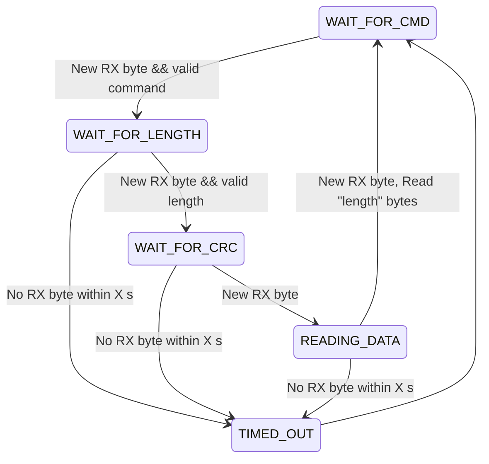

# Telemtry Node

## VSTP - Very Simple Telemetry Protocol

| Byte | Field | Description |
| --- | --- | --- |
| 0              | Command | Protocol command |
| 1              | Length  | Length of data |
| 2              | CRC     | CRC |
| 3...MAX_LENGTH | Data    | Payload data |

## Buffers

The telemetry node buffers incoming vstp data into its internal RX ring buffer.
The RX buffer consists of a ring buffer, which can hold X number of packets, given by `VSTP_RX_BUF_NBR_OF_PKTS`. While this is not super-efficient use of memory resource
(since some will be empty without being used), it makes the implementation simple.

Each slot in the ring buffer is of size `VSTP_PACKET_MAX_PAYLOAD_SIZE` (default 252 bytes),
which means that for 50 slots, it can buffer a maximum of 50*252=12600 bytes.

## Data transmission
The telemetry node transmits data if there is at least one package in the RX buffer
and the streaming is activated.

## Commands
| Command | Description |
| --- | --- |
| VSTP_CMD_LOG_START    | Starts streaming data upstream (**required**) in order for the telemetry node to start sending any data upstream. |
| VSTP_CMD_LOG_STOP     | Stops streaming data upstream | |
| VSTP_CMD_LOG_DATA     | Packet contains logging data  |
| VSTP_CMD_LOG_SD_START | Starts writing data to SD card. This creates a new file on the SD card. |
| VSTP_CMD_LOG_SD_STOP  | Stops writing data to the SD card. |
